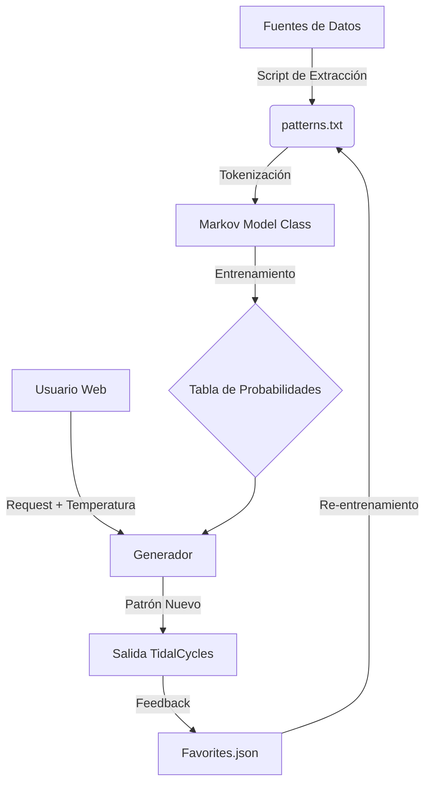

# 🧠 Anatomía del Cerebro TidalAI

Este documento detalla la arquitectura técnica, el funcionamiento interno y las fuentes de datos del sistema de Inteligencia Artificial de TidalAI Companion.

---

## 1. Arquitectura del Sistema

El "cerebro" no es una red neuronal masiva (como GPT), sino un modelo probabilístico ligero y eficiente diseñado para correr en una Raspberry Pi con latencia cero.



## 2. El Corpus (La Memoria)

El corpus es la base de conocimiento del sistema. Actualmente contiene **~440 patrones únicos** derivados de tres fuentes:

| Fuente | Descripción | Aporte al Conocimiento |
|---|---|---|
| **Samples Locales** | Base original (`bd`, `sn`, `hh`) | Estructuras rítmicas básicas y nombres de samples reales. |
| **Géneros Musicales** | `06_generos.html` | Estructuras de Techno, House, DnB, Trap, etc. |
| **Documentación Técnica** | `04_efectos`, `07_tecnicas` | Uso correcto de sintaxis, efectos (`# lpf`), y funciones complejas (`every`, `jux`). |

### Estructura de los Datos
El sistema almacena "frases musicales completas". No aprende notas sueltas, aprende **contextos**.
*   **Input**: `d1 $ every 4 (fast 2) $ s "bd sn"`
*   **Conceptos aprendidos**:
    *   Que `every` suele ir seguido de un número (`4`).
    *   Que `fast` es una transformación válida dentro de `every`.
    *   Que `s` define el sonido final.

## 3. El Motor: Cadenas de Markov (Markov Chains)

El núcleo algorítmico es una **Cadena de Markov de Orden Variable** (típicamente Orden 2 o 3).

### 3.1 Tokenización Inteligente
El sistema no lee letra por letra. Usa un tokenizador léxico específico para TidalCycles:
*   Frase: `sound "bd(3,8)"`
*   Tokens: `['sound', '"bd', '(', '3', ',', '8', ')', '"']`

Esto evita errores de sintaxis (ej. nunca romperá la palabra `sound` en `so` + `und`).

### 3.2 Probabilidad de Transición (N-Grams)
El cerebro construye un mapa de probabilidades basado en el historial reciente (N-Grams).

**Ejemplo Simplificado:**
Si el modelo ha escrito: `sound "bd`

Mira en su tabla de memoria: *"¿Qué suele venir después de `sound "bd`?"*

*   Opción A: `*4"` (Probabilidad 40% - *Techno*)
*   Opción B: `(3,8)"` (Probabilidad 30% - *Euclidiano*)
*   Opción C: `~ sn"` (Probabilidad 20% - *Breakbeat*)
*   Opción D: `[sn cp]"` (Probabilidad 10% - *Complejo*)

### 3.3 Temperatura (Creatividad)
El parámetro "Temperatura" (`temp`) altera estas probabilidades matemáticamente antes de tirar el dado:

*   **Temp 0.5 (Frío)**: Exagera las probabilidades altas. Casi siempre elegirá la Opción A. Resultado: Músicalmente seguro, repetitivo.
*   **Temp 1.5 (Caliente)**: Iguala las probabilidades. La Opción D (rara) tiene casi tantas chances como la A. Resultado: Caótico, innovador, sorpresivo.

## 4. Ciclo de Vida del Dato

1.  **Ingesta**: Python scripts (`import_all_docs.py`) leen archivos HTML, limpian la basura y extraen solo el código.
2.  **Entrenamiento**: Al arrancar, el servidor Flask lee `patterns.txt` y construye las matrices de transición en RAM (< 50ms).
3.  **Inferencia**: Cuando pulsas "Generar", el modelo camina por la cadena de Markov hasta generar un patrón válido.
4.  **Evolución**: Si guardas un patrón en Favoritos, este se añade al corpus, haciendo que esas transiciones sean más probables en el futuro.

## 5. Capacidades Actuales

Gracias a la última inyección de datos, tu cerebro artificial domina:
*   **Polimetría**: `{3, 4}`
*   **Funciones Estocásticas**: `degrade`, `sometimes`
*   **Síntesis**: `superpiano`, `supersaw`
*   **Efectos**: Toda la cadena de `lpf`, `room`, `shape`, `crush`.

## 6. Inteligencia Colectiva y Evolución (Pesos Estéticos)

A partir de la v1.5, el Cerebro ha dejado de ser un modelo estático para convertirse en uno **configurable y evolutivo**.

### 6.1 Pesos de Gusto Artístico
El usuario puede alterar la "personalidad" de la IA mediante pesos dinámicos en `config_evolution.json`:
*   **Densidad**: Prioriza patrones con más eventos por ciclo.
*   **Variedad**: Fomenta el uso de tokens únicos (evita la monotonía).
*   **Complejidad**: Premia el uso de funciones avanzadas (`jux`, `every`, `struct`).
*   **Groove (Euclidiano)**: Valora positivamente las estructuras matemáticas de tipo `(k, n)`.

### 6.2 El Algoritmo Genético (Ronda Nocturna)
El sistema ejecuta procesos de **Evolución por Selección**:
1.  **Mutación**: Genera 50-100 candidatos con alta temperatura.
2.  **Evaluación**: Aplica los pesos estéticos para dar una puntuación a cada uno.
3.  **Supervivencia**: Los 10 mejores patrones son inyectados de vuelta al `patterns.txt`.
4.  **Auto-aprendizaje**: El modelo se re-entrena automáticamente con la nueva "sabiduría" colectiva.

## 7. Introspección y Visualización

Para evitar el efecto de "caja negra", hemos abierto las puertas al interior del Cerebro.

### 7.1 Mapa Mental (D3 Graph)
Una representación topológica de los **Tokens**. Permite ver los "clústers de pensamiento":
*   Los nodos son palabras del lenguaje Tidal.
*   Los enlaces son las transiciones probables aprendidas.
*   El tamaño del nodo indica la frecuencia de uso (importancia).

### 7.2 Flujo de Pensamiento (Live Thought Stream)
Durante la generación, el sistema exporta su **monólogo interno**:
*   Muestra el token elegido actualmente.
*   Muestra las **3 alternativas descartadas** con sus porcentajes de probabilidad.
*   Permite al usuario entender *por qué* la IA eligió un sample de bombo o una función de filtro.

---
## 8. Procesamiento Semántico (El Oráculo)

El Oráculo actúa como una capa de traducción entre el lenguaje natural y los parámetros técnicos.

*   **Motor**: `oracle_engine.py` usa un modelo de scoring basado en léxicos ponderados.
*   **Mapeo**:
    *   *Intención*: "más tribal y oscuro"
    *   *Traducción*: `{density_offset: +0.2, style_pref: 'organic', extra_tokens: ['# lpf 1000']}`
*   **Pipeline**: El resultado del Oráculo se inyecta como modificador en el generador de patrones antes de la inferencia.

## 9. Orquestación Polifónica (Poly-Spread)

Para evitar la limitación de sobreescritura de parámetros en TidalCycles, el sistema implementa un **Layer Splitter**.

1.  **Parseo**: `get_layers()` rompe el string original usando `#` como delimitador.
2.  **Identificación de Fuentes**: Separa los bloques que definen sonido (`s`, `sound`) de los efectos.
3.  **Distribución**: Si se encuentran `N` fuentes de sonido, se generan `N` mensajes OSC para canales contiguos (`d1`, `d2`, ...).
4.  **Herencia**: Los efectos comunes (ej: `# room 0.5`) se replican en todas las capas para mantener la integridad del diseño sonoro.

---

## 10. The Intelligent Theorist: Validación Musical (Phase 17)

Introducido en v4.3, el `TheoryEngine` actúa como un **juez musical** que valida patrones contra reglas de teoría.

### 10.1 Arquitectura
```python
class TheoryEngine:
    def __init__(self):
        self.rules = self._load_rules('theory_rules.json')
    
    def validate(self, pattern, genre):
        for rule in self.rules[genre]:
            if rule['active'] and not self._check_rule(pattern, rule):
                return False, rule['message']
        return True, None
```

### 10.2 Tipos de Reglas
- **Hardcoded**: Funciones Python que analizan la estructura del patrón (e.g., `_rule_kick_on_one`).
- **Regex**: Expresiones regulares definidas en JSON para detección de patrones (e.g., `"bd.*~"` para bombos sincopados).

### 10.3 Bucle de Validación
En `app.py`, el endpoint `/api/generate` implementa un **retry loop**:
1. Genera patrón con IA.
2. Valida contra `TheoryEngine`.
3. Si falla, reintenta hasta 3 veces con `temperature += 0.1`.
4. Retorna `validation_info` en JSON con el resultado.

### 10.4 Rules Editor (Phase 17b)
Interfaz web para gestión dinámica de reglas:
- **Toggle ON/OFF**: Activar/desactivar reglas por género.
- **Custom Regex**: Añadir reglas personalizadas basadas en expresiones regulares.
- **Persistencia**: `theory_rules.json` se actualiza en tiempo real.

---

## 11. Latent Space Navigation: Interpolación Vectorial (Phase 18)

Introducido en v4.4, el `LatentEngine` permite mezclar géneros matemáticamente.

### 11.1 Arquitectura
```python
class LatentEngine:
    def __init__(self):
        self.genre_vectors = {
            "techno": {"density": 0.8, "complexity": 0.6, "tempo": 140},
            "ambient": {"density": 0.3, "complexity": 0.4, "tempo": 90}
        }
    
    def blend_multiple(self, blend_config):
        # blend_config = {"techno": 0.7, "ambient": 0.3}
        result = {}
        for genre, weight in blend_config.items():
            vec = self.genre_vectors[genre]
            for param, value in vec.items():
                result[param] = result.get(param, 0) + (value * weight)
        return result
```

### 11.2 Interpolación Lineal
Cada género es un "vector" en un espacio de parámetros. La mezcla se calcula como:
```
resultado = (vector_A * peso_A) + (vector_B * peso_B)
```

**Ejemplo**:
```
70% Techno + 30% Ambient:
density = (0.8 * 0.7) + (0.3 * 0.3) = 0.65
tempo = (140 * 0.7) + (90 * 0.3) = 125
```

### 11.3 Single Source of Truth
Los géneros disponibles se leen desde `theory_rules.json`, manteniendo consistencia entre `TheoryEngine` y `LatentEngine`.

### 11.4 Validación Ponderada
En modo blend, las reglas del Theorist se aplican según el peso:
- **Género dominante (>50%)**: Reglas obligatorias.
- **Género secundario (<50%)**: Reglas opcionales (advertencias).

---
*Documento actualizado v4.4 - Enero 2026*
*TidalAI Assistant Core*
