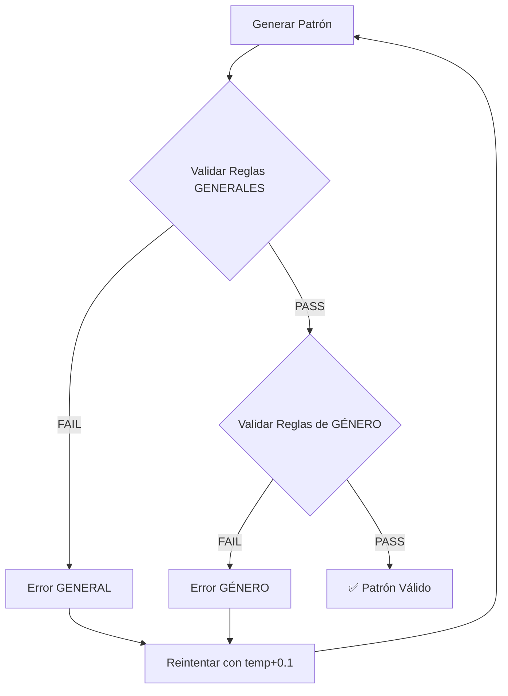

# 📐 Complete Music Theory Rules Reference - v4.5.0

**TidalAI Companion - The Complete Theorist**  
**Fecha**: 27 de Enero de 2026

---

## 📊 Resumen Ejecutivo

| Categoría | Reglas | Descripción |
|-----------|--------|-------------|
| **General** | 10 | Reglas universales de teoría musical |
| **Techno** | 2 | Reglas específicas de Techno |
| **House** | 2 | Reglas específicas de House |
| **Drum & Bass** | 2 | Reglas específicas de DnB |
| **Ambient** | 2 | Reglas específicas de Ambient |
| **Breakbeat** | 2 | Reglas específicas de Breakbeat |
| **Dub** | 2 | Reglas específicas de Dub |
| **Experimental** | 2 | Reglas específicas de Experimental |
| **Trap** | 2 | Reglas específicas de Trap |
| **Cyberpunk** | 2 | Reglas específicas de Cyberpunk |
| **Industrial** | 2 | Reglas específicas de Industrial |
| **DeepSea** | 2 | Reglas específicas de DeepSea |
| **Glitch** | 2 | Reglas específicas de Glitch |
| **Organic** | 2 | Reglas específicas de Organic |
| **TOTAL** | **36** | **Reglas implementadas** |

---

## 🌍 Reglas Generales (ALWAYS APPLIED)

Estas reglas se aplican a **TODOS** los patrones, independientemente del género seleccionado.

### 1. No Empty Patterns
**Propósito**: Garantizar que el patrón contenga al menos un evento sonoro.

**Lógica**:
- Rechaza patrones vacíos (`""`)
- Rechaza patrones que solo contienen espacios
- Rechaza patrones que solo son un silencio (`"~"`)

**Ejemplos**:
- ❌ `""` → "Pattern cannot be empty"
- ❌ `"~"` → "Pattern cannot be empty"
- ✅ `"bd ~ sn ~"` → PASS

---

### 2. Balanced Parentheses
**Propósito**: Verificar sintaxis válida de TidalCycles.

**Lógica**:
- Usa un stack para validar apertura/cierre de:
  - Paréntesis `()`
  - Corchetes `[]`
  - Llaves `{}`

**Ejemplos**:
- ❌ `"bd [sn cp"` → "Unbalanced parentheses/brackets"
- ❌ `"bd (3,8"` → "Unbalanced parentheses/brackets"
- ✅ `"bd [sn cp] hh"` → PASS

---

### 3. Max 50% Silence
**Propósito**: Evitar patrones excesivamente vacíos.

**Lógica**:
- Cuenta tokens totales vs silencios (`~`)
- Calcula ratio: `silence_count / total_tokens`
- Rechaza si ratio > 0.5

**Ejemplos**:
- ❌ `"bd ~ ~ ~ ~ ~"` → "Too much silence (83% > 50%)"
- ✅ `"bd ~ sn ~"` → PASS (50%)
- ✅ `"bd sn hh cp"` → PASS (0%)

---

### 4. Valid Euclidean (k<=n)
**Propósito**: Validar notación euclidiana correcta.

**Lógica**:
- Busca patrones `(k,n)` con regex
- Verifica que `k <= n` para cada uno

**Ejemplos**:
- ❌ `"bd(5,3)"` → "Invalid Euclidean: (5,3) - k must be <= n"
- ✅ `"bd(3,8)"` → PASS
- ✅ `"sn(5,8) hh(7,16)"` → PASS

---

### 5. No Consecutive Silences (REGEX)
**Propósito**: Simplificar patrones eliminando silencios redundantes.

**Lógica**:
- Busca patrón `~ ~` (dos silencios consecutivos)
- Sugiere usar un solo silencio

**Ejemplos**:
- ❌ `"bd ~ ~ sn"` → "No Consecutive Silences"
- ✅ `"bd ~ sn ~"` → PASS

---

### 6. Valid Speed Range (0.25-4.0)
**Propósito**: Evitar velocidades extremas que causen problemas de audio.

**Lógica**:
- Busca `speed X` en el patrón
- Verifica que `0.25 <= X <= 4.0`

**Ejemplos**:
- ❌ `"bd # speed 10"` → "Invalid speed: 10 (must be 0.25-4.0)"
- ✅ `"bd # speed 2"` → PASS
- ✅ `"sn # speed 0.5"` → PASS

---

### 7. Valid Filter Range (20-20kHz)
**Propósito**: Mantener filtros dentro del rango audible humano.

**Lógica**:
- Busca `lpf X` o `hpf X`
- Verifica que `20 <= X <= 20000`

**Ejemplos**:
- ❌ `"bd # lpf 50000"` → "Invalid filter: 50000Hz (must be 20-20000)"
- ✅ `"bd # lpf 800"` → PASS
- ✅ `"sn # hpf 200"` → PASS

---

### 8. No Extreme Density Jumps
**Propósito**: Evitar saltos bruscos de densidad rítmica.

**Lógica**:
- Detecta patrones muy rápidos (`*12` a `*16`)
- Detecta patrones muy lentos (`*0.1` a `*0.5`)
- Rechaza si ambos están presentes

**Ejemplos**:
- ❌ `"bd*16 sn*0.25"` → "Extreme density jump"
- ✅ `"bd*8 sn*4"` → PASS
- ✅ `"hh*16 cp*8"` → PASS

---

### 9. Valid Sample Syntax
**Propósito**: Verificar sintaxis correcta de samples.

**Lógica**:
- Busca `s` seguido de nombre sin comillas
- Sugiere usar comillas: `s "bd"` en lugar de `s bd`

**Ejemplos**:
- ❌ `"s bd"` → "Sample name must be quoted: s \"bd\" not s bd"
- ✅ `"s \"bd\""` → PASS

---

### 10. No Orphan Effects
**Propósito**: Evitar efectos sin fuente de sonido.

**Lógica**:
- Verifica presencia de `s` o `sound`
- Verifica presencia de efectos (`lpf`, `hpf`, `room`, `delay`, `gain`)
- Rechaza si hay efectos pero no hay sonido

**Ejemplos**:
- ❌ `"# lpf 800"` → "Effects without sound source"
- ✅ `"s \"bd\" # lpf 800"` → PASS

---

## 🎛️ Reglas por Género

### 🔊 TECHNO

#### 1. Kick Pattern (4/4)
**Propósito**: Techno requiere kick drum en patrón regular 4/4.

**Lógica**:
- Verifica presencia de `bd`
- Rechaza si el kick está muy sincopado (`bd ~ ~ ~`)

**Ejemplos**:
- ❌ `"sn*4 hh*8"` → "Techno requires kick drum (bd)"
- ❌ `"bd ~ ~ ~ sn"` → "Techno kick too sparse (4/4 pulse required)"
- ✅ `"bd*4 sn*2"` → PASS

#### 2. No Heavy Swing
**Propósito**: Techno evita swing excesivo.

**Lógica**:
- Detecta patrones de swing con `bd` + corchetes + silencios

**Ejemplos**:
- ❌ `"bd [~ sn ~]"` → "Techno should avoid heavy swing patterns"
- ✅ `"bd*4 hh*8"` → PASS

---

### 🏠 HOUSE

#### 1. Four-on-Floor Kick
**Propósito**: House requiere bombo constante (four-on-floor).

**Lógica**:
- Busca `bd*4` o `bd*8`

**Ejemplos**:
- ❌ `"bd ~ sn ~"` → "House requires four-on-floor kick (bd*4 or bd*8)"
- ✅ `"bd*4 cp*2"` → PASS

#### 2. Offbeat Hi-Hats
**Propósito**: House típicamente tiene hats rápidos en offbeat.

**Lógica**:
- Si hay `hh`, debe estar con `*8` o superior

**Ejemplos**:
- ❌ `"bd*4 hh*4"` → "House hats should be fast (*8 or higher)"
- ✅ `"bd*4 hh*8"` → PASS

---

### 🥁 DRUM & BASS

#### 1. High Density (*8+)
**Propósito**: DnB requiere alta densidad rítmica.

**Lógica**:
- Cuenta marcadores de densidad: `*8`, `*9`, `*10-16`, `[`
- Requiere al menos 2

**Ejemplos**:
- ❌ `"bd*4 sn*2"` → "DnB requires high rhythmic density (*8+, brackets)"
- ✅ `"bd*8 [sn cp]*16"` → PASS

#### 2. Breakbeat Structure
**Propósito**: DnB debe tener estructura de breakbeat.

**Lógica**:
- Requiere tanto kick (`bd`) como snare (`sn` o `cp`)

**Ejemplos**:
- ❌ `"bd*8 hh*16"` → "DnB requires both kick and snare"
- ✅ `"bd*8 sn(5,8)"` → PASS

---

### 🌊 AMBIENT

#### 1. Low Density
**Propósito**: Ambient requiere baja densidad.

**Lógica**:
- Rechaza patrones con `*8` o superior

**Ejemplos**:
- ❌ `"pad*8 drone*16"` → "Ambient should avoid high density (*8+)"
- ✅ `"pad*2 ~ drone*1"` → PASS

#### 2. Texture Focus
**Propósito**: Ambient prioriza texturas sobre percusión.

**Lógica**:
- Cuenta elementos percusivos (`bd`, `sn`, `cp`, `hh`)
- Cuenta elementos texturales (`pad`, `texture`, `drone`, `field`)
- Rechaza si percusión > texturas y percusión > 2

**Ejemplos**:
- ❌ `"bd sn cp hh"` → "Ambient should focus on textures, not percussion"
- ✅ `"pad drone field"` → PASS

---

### 💥 BREAKBEAT

#### 1. Syncopation Required
**Propósito**: Breakbeat requiere sincopación.

**Lógica**:
- Busca silencios (`~`) o corchetes con silencios

**Ejemplos**:
- ❌ `"bd*4 sn*4"` → "Breakbeat requires syncopation (~ or brackets)"
- ✅ `"bd ~ sn [~ cp]"` → PASS

#### 2. Varied Rhythm
**Propósito**: Breakbeat debe tener ritmo variado.

**Lógica**:
- Detecta repetición excesiva del mismo patrón 3 veces

**Ejemplos**:
- ❌ `"bd*4 bd*4 bd*4"` → "Breakbeat should have varied rhythm (too repetitive)"
- ✅ `"bd*4 sn*2 hh*8"` → PASS

---

### 🔉 DUB

#### 1. Space & Delay
**Propósito**: Dub requiere espacio y delay.

**Lógica**:
- Requiere silencios (`~`) O efectos de delay/room

**Ejemplos**:
- ❌ `"bd*4 sn*4"` → "Dub requires space (silence ~) or delay effects"
- ✅ `"bd ~ sn # delay 0.5"` → PASS

#### 2. Bass Focus
**Propósito**: Dub debe enfocarse en el bajo.

**Lógica**:
- Busca `bass`, `sub`, o `808`

**Ejemplos**:
- ❌ `"hh*8 cp*4"` → "Dub requires bass focus"
- ✅ `"bass*2 ~ sub"` → PASS

---

### 🎨 EXPERIMENTAL

#### 1. Unconventional Patterns
**Propósito**: Experimental debe romper convenciones.

**Lógica**:
- Cuenta marcadores convencionales (`bd*4`, `sn.*cp`, `hh*8`)
- Rechaza si hay más de 1

**Ejemplos**:
- ❌ `"bd*4 hh*8 sn cp"` → "Too conventional for Experimental"
- ✅ `"bd(7,13) [~ sn ~]"` → PASS

#### 2. Complex Structures
**Propósito**: Experimental debe tener estructuras complejas.

**Lógica**:
- Cuenta corchetes, paréntesis, llaves, etc.
- Requiere al menos 2

**Ejemplos**:
- ❌ `"bd sn hh"` → "Experimental should have complex structures"
- ✅ `"bd [sn (3,8)] {cp hh}"` → PASS

---

### 🎤 TRAP

#### 1. Hi-Hat Rolls (*12+)
**Propósito**: Trap requiere hi-hat rolls rápidos.

**Lógica**:
- Si hay `hh`, debe estar con `*12` o superior

**Ejemplos**:
- ❌ `"bd 808 hh*8"` → "Trap requires fast hi-hat rolls (*12+)"
- ✅ `"bd 808 hh*16"` → PASS

#### 2. 808 Bass Elements
**Propósito**: Trap típicamente usa 808 bass.

**Lógica**:
- Busca `808`, `bass`, o `sub`

**Ejemplos**:
- ❌ `"bd*4 sn*2"` → "Trap should include 808/bass elements"
- ✅ `"bd 808 hh*16"` → PASS

---

### 🤖 CYBERPUNK

#### 1. Digital/Synth Sounds
**Propósito**: Cyberpunk requiere sonidos digitales.

**Lógica**:
- Busca `synth`, `digital`, `cyber`, `glitch`, `chip`

**Ejemplos**:
- ❌ `"bd*4 sn*2"` → "Cyberpunk requires digital sounds"
- ✅ `"synth*8 cyber glitch"` → PASS

#### 2. Aggressive Rhythm
**Propósito**: Cyberpunk requiere ritmo agresivo.

**Lógica**:
- Busca densidad alta (`*6+`) O kick+snare

**Ejemplos**:
- ❌ `"synth*2 ~"` → "Cyberpunk requires aggressive rhythm"
- ✅ `"bd*8 sn synth*12"` → PASS

---

### ⚙️ INDUSTRIAL

#### 1. Harsh/Metallic Sounds
**Propósito**: Industrial requiere sonidos duros.

**Lógica**:
- Busca `metal`, `industrial`, `harsh`, `noise`, `clank`

**Ejemplos**:
- ❌ `"bd*4 sn*2"` → "Industrial requires harsh sounds"
- ✅ `"metal*4 clank noise"` → PASS

#### 2. Distortion/Noise
**Propósito**: Industrial usa distorsión.

**Lógica**:
- Busca `distort`, `crush`, `noise`, `gain 2+`

**Ejemplos**:
- ❌ `"metal*4"` → "Industrial should include distortion"
- ✅ `"metal # distort 0.8"` → PASS

---

### 🌊 DEEPSEA

#### 1. Atmospheric/Fluid
**Propósito**: DeepSea requiere atmósfera fluida.

**Lógica**:
- Busca `pad`, `reverb`, `room`, `ocean`, `water`, `wave`

**Ejemplos**:
- ❌ `"bd*4 sn*2"` → "DeepSea requires atmospheric sounds"
- ✅ `"pad ocean # reverb 0.9"` → PASS

#### 2. Low Tempo/Sparse
**Propósito**: DeepSea debe ser lento y espaciado.

**Lógica**:
- Rechaza densidad alta (`*8+`)
- Requiere silencios (`~`)

**Ejemplos**:
- ❌ `"pad*16 ocean*8"` → "DeepSea should be slow"
- ❌ `"pad ocean wave"` → "DeepSea requires space"
- ✅ `"pad ~ ocean ~"` → PASS

---

### 🔀 GLITCH

#### 1. Fragmented Patterns
**Propósito**: Glitch requiere fragmentación.

**Lógica**:
- Cuenta fragmentos (silencios + corchetes con silencios)
- Requiere al menos 2

**Ejemplos**:
- ❌ `"glitch*8"` → "Glitch requires fragmented patterns"
- ✅ `"glitch ~ [~ stutter] ~"` → PASS

#### 2. Digital Artifacts
**Propósito**: Glitch debe tener artefactos digitales.

**Lógica**:
- Busca `glitch`, `stutter`, `chop`, `cut`, `bit`

**Ejemplos**:
- ❌ `"bd ~ sn ~"` → "Glitch requires digital artifacts"
- ✅ `"glitch stutter chop"` → PASS

---

### 🌿 ORGANIC

#### 1. Natural/Field Sounds
**Propósito**: Organic requiere sonidos naturales.

**Lógica**:
- Busca `field`, `nature`, `wood`, `bird`, `wind`, `rain`, `organic`

**Ejemplos**:
- ❌ `"bd*4 synth*8"` → "Organic requires natural sounds"
- ✅ `"field bird wind"` → PASS

#### 2. Irregular Rhythm
**Propósito**: Organic debe tener ritmo irregular.

**Lógica**:
- Cuenta patrones regulares (`bd*4`, `sn*4`, `hh*8`)
- Rechaza si hay más de 1

**Ejemplos**:
- ❌ `"bd*4 sn*4 hh*8"` → "Organic should have irregular rhythm"
- ✅ `"field ~ bird(3,7)"` → PASS

---

## 🎯 Flujo de Validación

---

## 📈 Estadísticas de Cobertura

| Aspecto | Cobertura |
|---------|-----------|
| **Géneros cubiertos** | 13/13 (100%) |
| **Reglas generales** | 10 |
| **Reglas por género** | 26 |
| **Total de reglas** | 36 |
| **Tipos de validación** | Hardcoded + Regex |

---

**TidalAI Companion v4.5.0 - The Complete Theorist**  
*Documentación actualizada - 27 de Enero de 2026*
